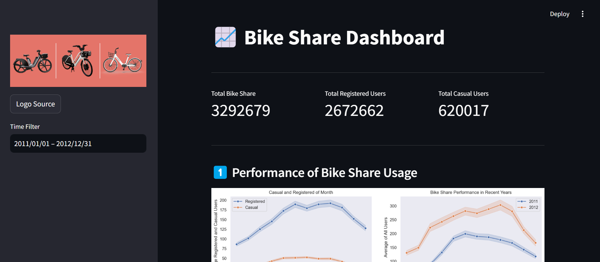

# Bike Share Analysis 📈

## 📌 Analysis

### Defining Question
- Which season has the highest and lowest average number of bike-sharing?
- What are the average daily usage patterns of bike share services?
- How has the number of bicycle users performed in recent years?
- How does the number of bike-share differ in terms of casual and registered users on working days and holidays?
- Which days of the week have the highest number of rentals?
- How does the weather affect rental patterns at various times of the day (like :early morning, dawn, morning, daytime, afternoon, evening)?

### Answer
1. The season with the highest number of rentals (both total and average) is Summer, while Winter has the lowest number of rentals. There are significant fluctuations in the total number of bike share between seasons. However, overall, the total number of rentals tends to be stable throughout the year.

2. For both registered and casual users, the average peak of bike share usage occurs at 5pm. Meanwhile, 4am is the least popular time to bike share.

3. In general, the number of bike share has increased from 2011 to 2012. This also had a corresponding impact with both casual and registered users increasing in the following year. This indicates a positive trend in bicycle use.

4. Bike share occurs more on working days than holidays. Then, there are different usage patterns of registered and casual users on working days and holidays. With working days being dominated by registered users. On holidays, there are more casual users.

5. The highest total bike share usage occurred on Friday. Overall, bike share was fairly stable throughout the week. Nonetheless, weekdays (Monday to Friday) tend to have a slightly higher amount of usage, especially for registered users. In contrast, casual users tend to use their bicycles more on weekends.

6. Weather conditions have a very significant influence on bike share patterns. Clear weather greatly encourages bike usage, while bad weather, especially heavy rain, significantly reduces the number of bike share.

## 📌 Dashboard
### Streamlit

<p align="center">
  

## 📌 Setup Environtment

### Setup Environment - Shell/Terminal
```
mkdir project_bike_sharing
cd project_bike_sharing
pipenv install
pipenv shell
pip install -r requirements.txt
```

### Run steamlit app
```
cd dashbord
streamlit run dashboard.py
```